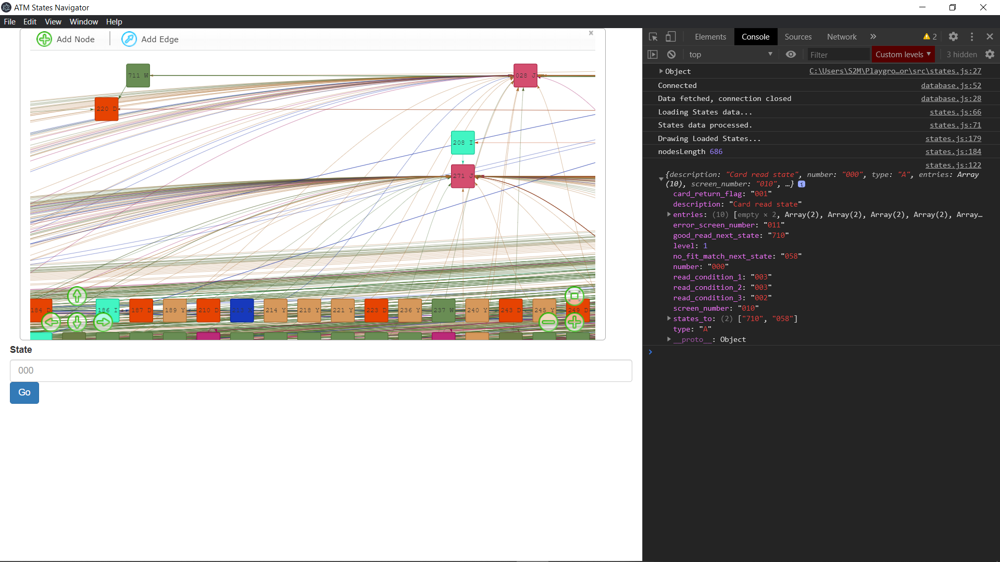

###States Navigator - Electron, visjs

A simple ATM states navigator, refer to [APTRA™ Advance NDC](https://manualzz.com/download/22094070), written using ES6 JavaScript, [visjs](http://visjs.org/), jQuery and [Electron](https://electron.atom.io/) framework.

App Home page:



States Modal:


## Install

You can build the app from sources. To do this, you'll need [Git](https://git-scm.com) and [Node.js version 8.x](https://nodejs.org/en/download/) (which comes with [npm](http://npmjs.com)) installed on your computer. From the command line:

```bash
# Clone the repo
git clone https://github.com/EstaPro/electron-states-navigator
# Jump into the repo
cd electron-states-navigator
# Get dependencies
npm install
# Run the app
npm start
```

## Features 

This is a side project of my full-time job and only the features that I currently need in my everyday work are implemented. 

Currently only the basic stuff is working, such as:
 * Connecting directly to database to get states;
 * Showing graph of states;
 * Customs color for diffrent states types;
 * Moving through almost all the basic states (ICC states are passed through as well);
 * Saving states configuration data, and restoring it on application start;
 * Displaying state details when state selected;
 * Jump into state documentation when state type clicked;

Things to be implemented :
 * Create & Edit new states with visjs;
 * Showing basic image screens linked to the state;
 * Keyboard shortcuts: To Navigate & Edit States;

 ## Credits
  This project is based on [timgabets](https://raw.githubusercontent.com/timgabets)'s [ELECTRON-ATM](https://raw.githubusercontent.com/timgabets/electron-atm) project, which is a free open-source ATM emulator that contains a states Nav.
